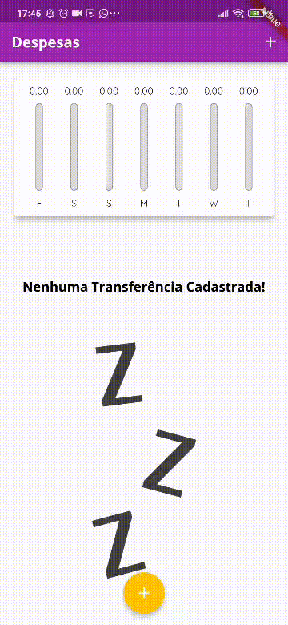

# Projeto Expenses

Segundo projeto apresentado no curso "Aprenda Flutter e Desenvolva Apps Para Android e IOS 2022" - "Seção 4: Construindo App Real - Despesas Pessoais" e "Seção 5: Interfaces Responsivas & Adaptativas". O intuito deste app seria ter um controle básico de suas economias.

Nele, eu aprendi e fixei alguns contéudos como: 
  -> Usar fontes diferentes e adicioná-las no pubspec.yaml
  -> Declarar e utilizar temas que o app inteiro irá se basear
  -> Ciclo de vida dos widgets
  -> Responsividade do app no modo vertical e horizontal
  -> Adaptabilidade para Android e iOS

Versão: ^3.7.7

